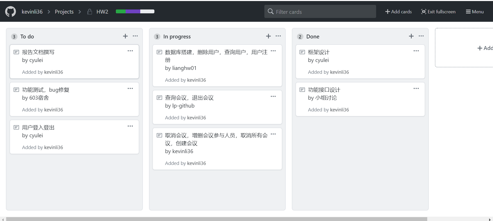
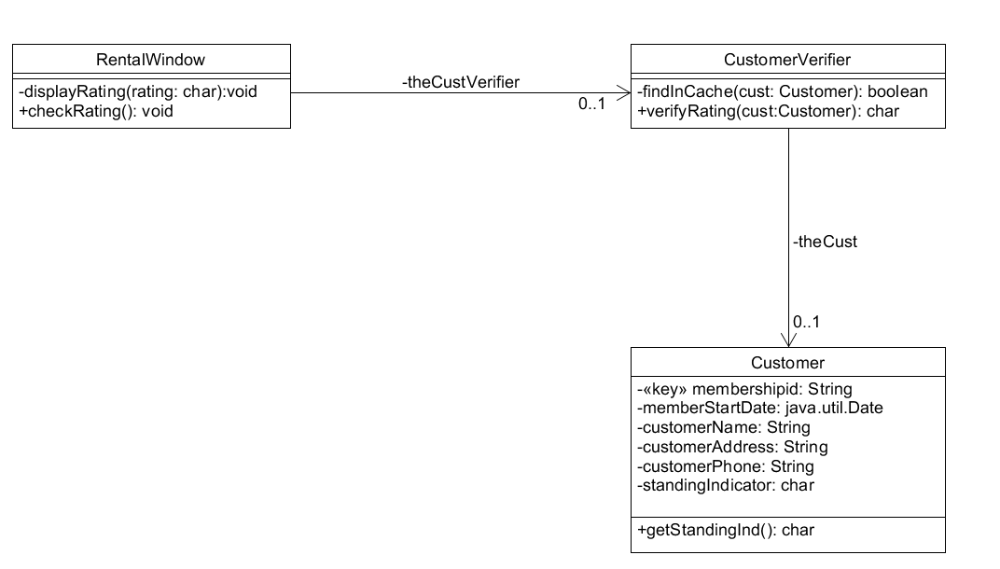

## 作业2

### 简答题

#### 1、用简短的语言给出对分析、设计的理解。
分析是对用户/市场需求进行分析，确定需求的可行性和无歧义。
设计是在分析后构建合理可行的系统搭建方案，功能接口设计。

#### 2、用一句话描述面向对象的分析与设计的优势。
把易变的数据结构和部分功能封装在对象内并加以隐藏，保证了对象行为的可靠性，有利于维护和复用。

#### 3、简述 UML（统一建模语言）的作用。考试考哪些图？
UML提供了描述程序模型的一个标准，让开发人员、客户更好的进行交流。
考试考查范围为：动态图和静态图。

#### 4、从软件本质的角度，解释软件范围（需求）控制的可行性
大型软件项目的需求管理阶段主要活动包括：需求确认，需求变更和需求跟踪控制三大部分。
需求确认阶段，可通过需求讨论会、原型法等获取明确的需求，之后编写用户需求规格说明书。在对用户需求进行分析后，最终由用户与开发团队双方最终确认需求。
需求变更阶段，由于大型软件项目具有周期长、功能复杂的特性，因此实际开发过程中的需求变更是不可避免的。当需求变更出现时，开发团队可通过讨论会讨论是否接受变更，若接收则应发布新的需求基线，并通知相关人员。
需求跟踪阶段，在大型的软件项目中心必须建立一种需求跟踪机制这种机制必须是双向的，可追溯的。当需求发生变更时，借由这种机制，对需求文档记录进行计时更新，保证其完整性、正确性和一致性。
综上所述，软件范围（需求）控制是可行的，这需要用户和开发者的双向努力，在软件开发过程中不断维护、更新、控制项目需求。

### 看板使用练习

### UML使用练习
参考页数 Requirements Analysis and System Design P145

