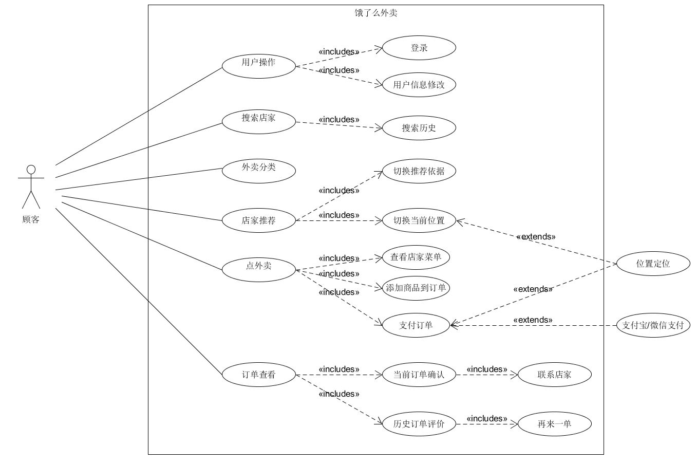

## 作业4

### 简答题

#### 1、用例的概念
描述参与者为了达成某个目标使用系统的一系列成功与失败的场景集合

#### 2、用例和场景的关系？什么是主场景或 happy path？
用例是场景的集合。

主场景是指最常用、直接地实现用户目标的场景（通常是指成功场景）

#### 3、用例有哪些形式？
用例有三种形式: brief, casual和fully。

Brief: 约为一页的概述，主要描述主场景

Casual: 非正式的形式，包含多个场景

Fully: 详细描述用例步骤和变化，包括前置条件等。包含少数Brief/Casual中结构上十分重要的用例，将其更为详细的描述。

#### 4、对于复杂业务，为什么编制完整用例非常难？
寻找用例主要有4个步骤:

1、界定系统边界

2、确定主要的参与者

3、确定每个主要参与者的目标

4、定义满足用户目标的用例

对于复杂业务，系统主要参与者多，每个主要参与者的目标多，为编制完整的用例，需要对于每个参与者的目标进行详细的描述，对于完成用户目标的步骤、前置条件等进行详细描述，因此复杂业务的完整用例编制十分困难。

#### 5、什么是用例图？
由参与者（Actor）、用例（Use Case），边界以及它们之间的关系构成的用于描述系统功能的视图。

#### 6、用例图的基本符号与元素？

|元素|说明|符号
-|-|-
|参与者(Actor)|与应用程序进行交互的用户、组织或者外部系统|
|用例(Use Case)|表示的是对系统提供的功能、服务的一种描述|
|包含关系(Include)|表示用例可以简单地包含其他用例所具有的行为，并把它所包含的用例行为作为自身行为的一部分|
|泛化关系(Generalization)|泛化指的是一个父用例可以被特化形成多个子用例，而父用例和子用例之间的关系就是泛化关系|
|关联关系(Association)|表示的是参与者与用例之间的关系|
|扩展/延伸关系(Extend)|表示在一定条件下，把新的行为加入到已有的用例中，获得的新用例叫做扩展用例|

#### 7、用例图的画法与步骤

1、确立系统边界

2、提取参与者

2、确定不同参与者的用例

4、确定用例之间的关系

#### 8、用例图给利益相关人与开发者的价值有哪些？

* 明确系统的业务范围、服务对象（角色）、外部系统与设备
* 帮助识别技术风险，提前实施关键技术原型公关与学习
* 易于评估项目工作量，合理规划迭代周期，规划人力需要

### 建模练习题（用例模型）

#### 1、美团外卖/饿了么外卖用例图

**美团外卖**

**饿了么外卖**

（由于二者几乎完全一样，除了UI界面的不同，并未找出二者在用例上区别于竞争对手的创新点）

#### 2、为什么相似系统的用例图是相似的？
对于相似的系统，系统的参与者类似，参与者使用系统的目标类似，因此相似系统的用例是类似的，进而用例图也就是类似的。如上述的美团外卖与饿了么外卖的用例图，由于顾客查看店家、添加订单、支付等功能在两个系统上是一样的，因此最后呈现的用例图也就是类似的（甚至是完全一样的）。

#### 3、如何利用用例图定位创新思路（业务创新、或技术创新、或商业模式创新）在系统中的作用
比较系统与竞争对手的用例图，在用例上考虑功能的增量创新，在用例的实现上考虑技术创新（提高效率），在系统的设计上考虑模式的创新。

#### 4、请使用 SCRUM 方法，选择一个用例图，编制某定旅馆开发的需求（backlog）开发计划表

|ID|Name|Imp|Est|How to Demo|Note
-|-|-|-|-|-
|1|用户操作|10|10|登录，注册，绑定，个人信息修改|注意UI界面设计
|2|旅馆分类|15|20|根据星级、价位、评价等进行旅馆分类|
|3|搜索房间|30|30|根据位置，入住日期，入住人数，价格、星级进行旅馆房间搜索|结合用户历史订单对搜索结果进行排序
|4|旅馆详情显示|20|20|显示旅馆图片，价位，背景信息，可预定房间，住客评价
|5|房间预定|30|30|订单信息包括房间数，住客姓名，手机号码，保险
|6|支付|15|20|提供微信、支付宝、银联3中支付方式
|7|历史订单|10|5|查看用户历史订单，用户可提交反馈

#### 5、根据任务4，参考 使用用例点估算软件成本，给出项目用例点的估算

|用例|事务|计算|原因|UC权重
-|-|-|-|-|-
用户操作|3|3||简单
旅馆分类|5|5||一般
搜索房间|10|8||复杂
旅馆详情显示|6|4||一般
房间预定|7|5||一般
支付|4|2||简单
历史订单|3|2||简单